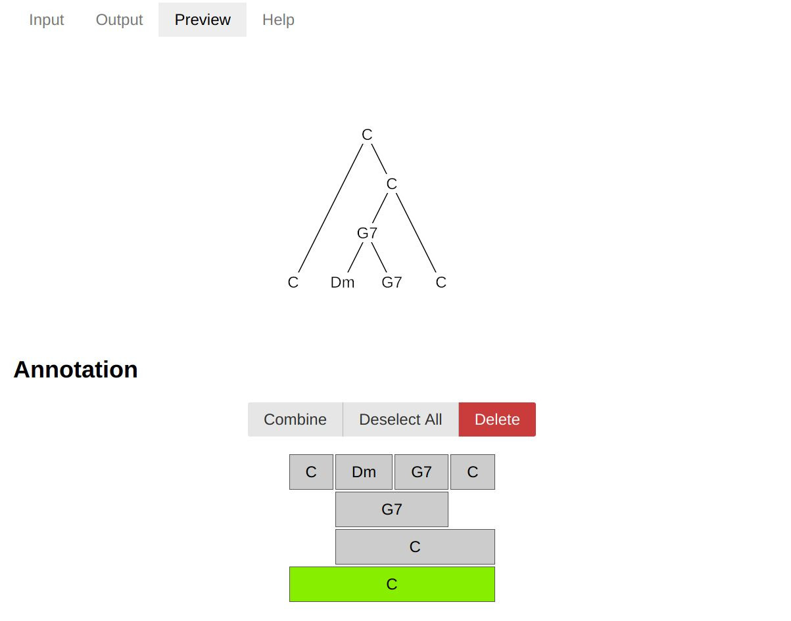

# Source code repository for the tree annotation tool

by [Daniel Harasim](https://people.epfl.ch/daniel.harasim),
[Christoph Finkensiep](https://people.epfl.ch/christoph.finkensiep),
and the [Digital and Cognitive Musicology Lab (DCML)](https://dcml.epfl.ch)

Find the web app [here](https://dcmlab.github.io/tree-annotation-code/).

The [tree annotation tool](https://dcmlab.github.io/tree-annotation-code/) is a simple and easy-to-use web app for creating trees.
The user provides a sequence of symbols and then creates a tree from bottom to top by successively combining elements.
The tool includes functionality for loading and exporting trees
in JSON or [qtree](https://ctan.org/pkg/tikz-qtree) format (useful for LaTeX),
as well as a preview visualization of the current tree.
Trees can be easily shared using special links that encode a tree in the URL,
[like this](https://dcmlab.github.io/tree-annotation-code/?tree=eyJsYWJlbCI6IkMiLCJjaGlsZHJlbiI6W3sibGFiZWwiOiJDIiwiY2hpbGRyZW4iOltdfSx7ImxhYmVsIjoiQyIsImNoaWxkcmVuIjpbeyJsYWJlbCI6Ikc3IiwiY2hpbGRyZW4iOlt7ImxhYmVsIjoiRG0iLCJjaGlsZHJlbiI6W119LHsibGFiZWwiOiJHNyIsImNoaWxkcmVuIjpbXX1dfSx7ImxhYmVsIjoiQyIsImNoaWxkcmVuIjpbXX1dfV19).

## Attribution
If you use this application or its source code in any way, please cite the the following paper:

D. Harasim, C. Finkensiep, P. Ericson, T. J. O'Donnell, and M. Rohrmeier (2020). The Jazz Harmony Treebank. In *Proceedings of the 21th International Society for Music Information Retrieval Conference*. Montréal, Canada.

## Funding 
This project has received funding from the European Research Council
(ERC) under the European Union's Horizon 2020 research and innovation
program under grant agreement No 760081 – PMSB. We gratefully
acknowledge the support of the Natural Sciences and Engineering
Research Council of Canada (NSERC), the Fonds de Recherche du
Qu\'{e}bec, Soci\'{e}t\'{e} et Culture (FRQSC), and the Canada CIFAR
AI Chairs program. We thank Claude Latour for supporting this research
through the Latour Chair in Digital Musicology. The authors
additionally thank the anonymous referees for their valuable comments
and the members of the Digital and Cognitive Musicology Lab (DCML) for
fruitful discussions.
